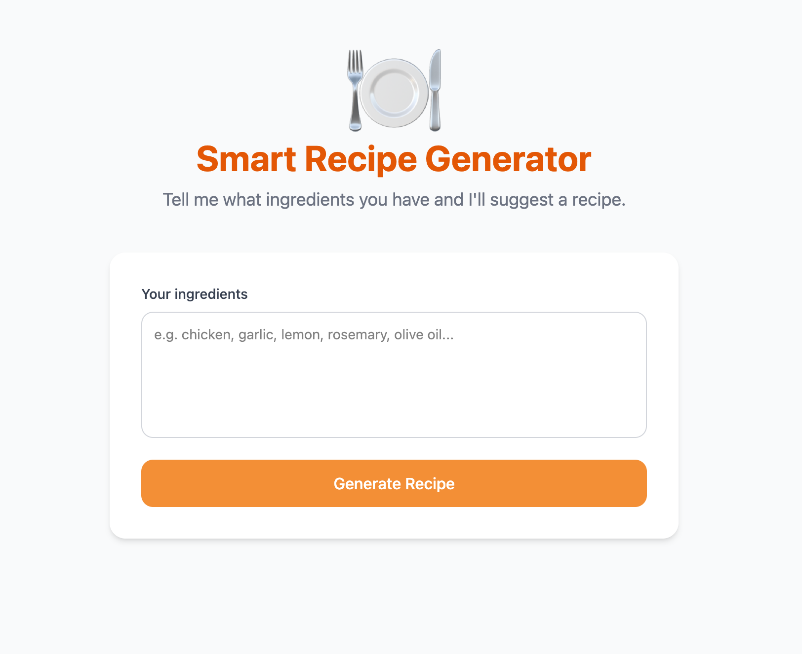

# Codelab: Add AI to Your Web App with Firebase AI Logic

## Overview

AI features used to mean spinning up a backend, managing API keys, and writing a lot of glue code just to get a response from a model. Firebase AI Logic changes that. It gives you a secure, Firebase-native SDK that lets your web app talk directly to Gemini — no server required.

This codelab is your starting point. You'll go from a plain React + Vite project to a fully working AI-powered web app, and along the way you'll understand not just _how_ Firebase AI Logic works, but _why_ it's structured the way it is. By the end, you'll have the foundation you need to drop AI features into any React project you're already working on.

### What you'll build

You'll build a **Smart Recipe Generator** — a web app where users describe the ingredients they have on hand and Gemini suggests a recipe in real time, with the response streaming directly to the UI as it's generated.



### What you'll learn

- How to install and configure Firebase AI Logic in a React + Vite project
- The difference between the Gemini Developer API backend and the Vertex AI backend — and when to use each
- How to generate and stream text responses from Gemini
- How to manage streaming state cleanly in React using `useState` and `useRef`
- How to handle loading states and errors gracefully in the UI

### What you'll need

- Basic knowledge of React and JavaScript
- [Node.js](https://nodejs.org/) v18 or higher installed on your machine
- A Google Account to create a Firebase project
- A code editor (we recommend [VS Code](https://code.visualstudio.com/))
- The bootstrapped React + Vite + Tailwind project you already have ready

---

## Set Up Your Firebase Project

Before touching any app code, you need a Firebase project to connect to.

### Create a Firebase Project

1. Go to the [Firebase Console](https://console.firebase.google.com/)
2. Click **Add project**
3. Give your project a name — something like `recipe-generator-ai`
4. You can leave Google Analytics enabled or disable it — it won't affect this codelab
5. Click **Create project** and wait for it to finish provisioning

### Register a Web App

Once your project is ready:

1. From the Project Overview page, click the **Web** icon (`</>`) to register a web app
2. Give your app a nickname, e.g. `recipe-web`
3. Leave **Firebase Hosting** unchecked for now — we'll focus on the AI integration
4. Click **Register app**
5. You'll see a `firebaseConfig` object — **keep this tab open**, you'll paste these values into your code in the next step

> [!INFO]
> The `apiKey` in `firebaseConfig` is **not** a secret. It's a project identifier — think of it like a username, not a password. Real security comes from Firebase App Check and Security Rules, which you'd set up before going to production.

### Enable Firebase AI Logic

1. In the left sidebar of the Firebase Console, click **Build > AI Logic**
2. Click **Get started**
3. Choose your AI provider — select **Gemini Developer API** (free to get started, no billing account needed)
4. Firebase will automatically enable the necessary Google Cloud APIs in the background. Click **Continue** when it's done.

> [!INFO]
> Planning to go to production or need higher rate limits? Choose the **Vertex AI** backend instead. You can always switch later with a one-line change in your code.

---

## Clone the Starter Pack

Clone the starter pack repo with the basic structure of our project

```bash
 git clone --URL-
 cd recipe-generator
 npm install

```

### Verify Your Project Structure

Your project should look roughly like this right now:

```
recipe-generator-ai/
├── public/
├── src/
│   ├── assets/
│   ├── components/
│      ├── RecipeGenerator.jsx
│   ├── App.jsx
│   ├── App.css
│   ├── index.css
│   └── main.jsx
├── index.html
├── package.json
├── tailwind.config.js
└── vite.config.js
```

By the end of this codelab you'll have added a new file and updated another :

- `src/firebase.js` — Firebase initialization and AI model instance
- `src/components/RecipeGenerator.jsx` — the main feature component where we will update our functionalities.

---

## Initialize Firebase and Firebase AI Logic

Let's create a dedicated file to initialize Firebase. This guarantees Firebase is set up once, and makes it easy to reuse the model instance anywhere in the app.

### Create `src/firebase.js`

```javascript
// src/firebase.js
import { initializeApp } from "firebase/app";
import { getAI, getGenerativeModel, GoogleAIBackend } from "firebase/ai";

// Replace these values with your own from the Firebase Console
const firebaseConfig = {
  apiKey: "YOUR_API_KEY",
  authDomain: "YOUR_PROJECT.firebaseapp.com",
  projectId: "YOUR_PROJECT_ID",
  storageBucket: "YOUR_PROJECT.appspot.com",
  messagingSenderId: "YOUR_SENDER_ID",
  appId: "YOUR_APP_ID",
};

// Initialize Firebase
const app = initializeApp(firebaseConfig);

// Initialize Firebase AI Logic with the Gemini Developer API backend
const ai = getAI(app, { backend: new GoogleAIBackend() });

// Get a Gemini model instance — export it so any component can use it
export const model = getGenerativeModel(ai, { model: "gemini-2.0-flash" });
```

> [!Note:]
> : Exporting `model` from `firebase.js` means your components never deal with initialization details. Any component can just `import { model } from "../firebase"` and start making AI requests immediately.

## Build the Recipe Generator Component

Now let's add our AI functionality to the project by updating `src/components/RecipeGenerator.jsx` to takes ingredient input and pass to our model, streams a response from Gemini, and renders it in real time.

### Open `src/components/RecipeGenerator.jsx`

```jsx
// src/components/RecipeGenerator.jsx
...
import { model } from "../firebase";

export default function RecipeGenerator() {
...

/**
 * Replace the Todo section with the below code to prompt our model,
 * Ensure its before the `handleReset()` function.
 *
 */

    const prompt = `You are a knowledgeable and passionate Nigerian chef with deep expertise
in traditional Nigerian and West African cuisine.
A user has the following ingredients available: ${ingredients}.
Suggest one authentic Nigerian or West African recipe they can make with these ingredients. Include:
- The name of the dish (in English and the local language name where applicable, e.g. Yoruba, Igbo, or Hausa)
- A short, mouth-watering description of the dish and its cultural significance
- A full list of ingredients with quantities, including any additional pantry staples they might need
- Clear step-by-step cooking instructions
- Any helpful tips on how the dish is traditionally served or enjoyed
Keep the tone warm, encouraging, and culturally proud. Write as if you're teaching a friend how to cook.`;


    try {
      const result = await model.generateContentStream(prompt);

      for await (const chunk of result.stream) {
        if (abortRef.current) break;
        setRecipe((prev) => prev + chunk.text());
      }
    } catch (err) {
      console.error("Firebase AI Logic error:", err);
      setError(
        "Something went wrong generating your recipe. Please try again.",
      );
    } finally {
      setLoading(false);
    }
  };
```

### Key Things to Notice

**Streaming with `generateContentStream`**
Instead of waiting for the full response, `generateContentStream` returns an async iterable. The `for await` loop appends each text chunk to the `recipe` state as it arrives — this is what creates the real-time typing effect users will see.

**`useRef` for abort control**
`abortRef` is a ref (not state) because changing it shouldn't trigger a re-render. When the user clicks Reset mid-stream, we flip `abortRef.current = true` and the `for await` loop stops processing new chunks on the next iteration.

**Skeleton loader before first chunk**
The pulsing skeleton is shown when `loading` is true but `recipe` is still empty. The moment the first chunk arrives and gets appended to `recipe`, the skeleton disappears and the output card takes its place — so the UI never feels frozen.

---

## Run and Test the App

Let's fire it up.

```bash
npm run dev
```

Open your browser at `http://localhost:5173` and try the app.

Type some ingredients and click **Generate Recipe**. You should see:

1. The button switches to **"Generating..."** and disables
2. A pulsing skeleton loader appears immediately
3. As the first chunk arrives, the output card replaces the skeleton and text streams in word by word
4. The **Reset** button appears so users can start a new request at any time
5. The button re-enables when streaming completes

> [!TIP]
> Test with `"beans, palm oil, onion, tatashe, locust beans"` for a pot of Ewa Agoyin.

---

## What's Next

Congratulations! 🎉 You've built a streaming, AI-powered React app with Firebase AI Logic — and you did it without writing a single line of backend code.

### What you accomplished

- Set up a Firebase project and enabled Firebase AI Logic
- Installed and initialized Firebase in a React + Vite + Tailwind project
- Built a clean component architecture with Firebase initialization separate from UI logic
- Used `generateContentStream` to stream Gemini responses into a React component in real time
- Handled loading states, errors, and mid-stream resets the React way

### Ideas to take this further

- **Add Firebase Auth** — Let users sign in and save their favourite generated recipes to Firestore
- **Add `systemInstruction`** — Pass a system instruction to the model to lock in a specific chef persona or enforce a consistent output format
- **Switch to the Vertex AI backend** — When you're ready for production, change `GoogleAIBackend()` to `VertexAIBackend()` in `firebase.js` — that's the only change needed
- **Go multimodal** — Let users photograph their fridge instead of typing ingredients.

### Resources

- [Firebase AI Logic Documentation](https://firebase.google.com/docs/ai-logic)
- [Firebase AI Logic Web SDK Reference](https://firebase.google.com/docs/reference/js/ai)
- [Gemini Model Reference](https://ai.google.dev/gemini-api/docs/models)
